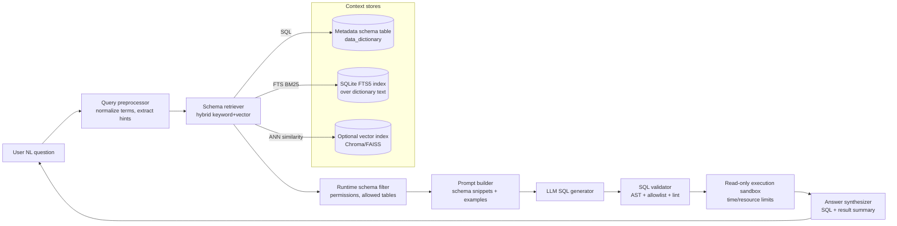

# Architectural Patterns and Tooling for Metadata-Driven Text-to-SQL RAG Systems

## Executive summary

Metadata-driven Text-to-SQL RAG systems treat a **schema “data dictionary”** (a metadata schema table containing table/column descriptions, synonyms, usage notes, and sometimes example queries) as the primary grounding source for generating executable SQL. In practice, the strongest designs combine **dynamic schema retrieval**, **context-window discipline**, and **hard guardrails** before any query is executed.

A robust production pattern is a **two-stage pipeline**: (1) *retrieve and filter* the relevant schema fragments (tables/columns/joins) from the metadata table (and optionally a vector index), then (2) *generate SQL* constrained to an allowlist (tables, operations), followed by *validation + safe execution* (read-only DB, AST validation, and explain-based checks). This structure directly addresses the core failure modes highlighted in modern benchmarks: schema ambiguity, value grounding, and multi-turn recovery.

Framework selection is largely an engineering tradeoff:
- **LangChain** is strongest when you want an “agent + tools” approach around SQL, plus a broad integration ecosystem (retrievers, vector stores, memory abstractions, and SQL toolkits).
- **LlamaIndex** has especially direct, first-class primitives for Text-to-SQL (e.g., query engines and schema/table retrieval indexes) and strong patterns for avoiding schema-context overflow.
- **Haystack** excels when you want an explicit, inspectable pipeline graph with routing and chat-memory components; Text-to-SQL can be implemented cleanly, but often requires a custom SQL execution component and careful prompt/guardrail design.

For retrieval, there are two common “local-first” options:
- **Vector store over schema text** (e.g., Chroma or FAISS) for semantic column/table matching, usually combined with metadata filters and/or keyword search for precision.
- **Direct SQL retrieval over the metadata table** using SQLite FTS5 for BM25-style keyword ranking and fast, consistent updates—sometimes augmented with hybrid search inside SQLite.

Security and correctness depend on hard controls: restricting permissions, enforcing read-only connections, validating SQL structure via parsing/AST checks (e.g., SQLGlot), and using parameter binding (placeholders) to avoid injection at execution time.

Open constraints that materially affect “best” architecture include: schema size (tables/columns), metadata quality (descriptions/synonyms), the latency budget, concurrent users, and whether the system must support multi-turn clarification and execution repair.

## Architectural patterns for metadata-driven Text-to-SQL RAG

A metadata schema table (data dictionary) is a natural fit for a RAG grounding layer because it is (a) **structured**, (b) **versionable**, and (c) can store the “semantic glue” that raw schemas lack—synonyms, business definitions, join hints, and example query patterns. Real-world reference architectures explicitly retrieve **table descriptions, column descriptions, synonyms, and sample queries** to improve matching between natural language and the database.

### End-to-end patterns

**Metadata-first Text-to-SQL (minimal external retrieval)**
1) Retrieve schema context from the database’s own schema + dictionary table; 2) Generate SQL; 3) Validate; 4) Execute; 5) Convert results to an answer. This is the simplest pattern and works best when schemas are small-to-medium and dictionary quality is high.

**Schema-RAG Text-to-SQL (dictionary-as-corpus)**
Treat the dictionary as a document corpus: each “document” can be a table description, column description, derived metric definition, or canonical join rule. Retrieval returns only the relevant fragments, keeping SQL generation grounded and shrinking context. This aligns with cloud reference designs that RAG-retrieve schema descriptions prior to SQL generation.

**Multi-stage retrieval (table → column → row/value hints)**
The overarching goal is to reduce ambiguity and context size by selecting only what matters to a question. LlamaIndex documents this explicitly: if you don’t constrain tables, it may “pull all the schema context,” risking context window overflow.

**Hybrid structured + unstructured RAG**
Some systems combine SQL querying over structured data with vector search over unstructured documents, then synthesize an answer (e.g., querying a database and a vector store together). LlamaIndex’s published examples describe engines that can combine SQL database results with vector-store context.

### Where and how to store/use the metadata schema table

Common, production-relevant placements:

**In the same SQL database as the facts (recommended for consistency)**
A `data_dictionary` table (or set of tables) stored alongside the facts supports transactional updates, simple governance, and SQL-based retrieval (including FTS). This also enables read-only connections for the whole analytic interface.

**In an enterprise catalog / metastore (then ingested for retrieval)**
Cloud reference solutions retrieve schema metadata from catalogs such as AWS Glue Data Catalog; the same principle applies on-prem with any metastore.

**Replicated into a vector store (for semantic schema matching)**
Store embeddings of table/column descriptions and synonyms in a vector DB and retrieve by similarity search, optionally filtering by metadata. Chroma’s docs emphasize metadata as both a filtering mechanism and context for the LLM.

### Context window management strategies

The key pattern is: **retrieve less, not more**.

- **Dynamic schema selection** is a first-order control: LlamaIndex explicitly warns that including all schema context can overflow the model context window, and therefore tables should be specified or retrieved dynamically.
- **Compression / summarization of retrieved context** is a second-order control: “contextual compression” and related retriever patterns are designed to return only the relevant parts of retrieved documents to limit token usage.
- **Conversation memory token limits** act as a third-order control to prevent history + schema + examples from exceeding limits; LlamaIndex documents memory designs centered on token budgets and flushing/summarization.
- **Long-context models reduce but do not eliminate the need for discipline**: GPT‑4.1 is described as supporting up to 1M tokens of context, and Anthropic’s API release notes describe a 1M token context window beta for some Claude models.

### Retrieval pipelines, hybrid retrieval, and runtime schema filtering

**Hybrid retrieval (keyword + vector)** is usually the best default for schema linking because:
- keyword matching captures exact names, IDs, acronyms, and business terms,
- vector similarity captures paraphrases and semantic matches (especially via descriptions/synonyms),
- combining them reduces “false semantic friends.”

Implementation options include:
- Haystack provides a catalog of retriever components, including hybrid retrievers in some backends (e.g., hybrid retrievers combining BM25 and dense similarity).
- SQLite can provide keyword retrieval over the dictionary via FTS5, and community solutions demonstrate “hybrid” designs inside SQLite that combine FTS and vector search.

**Runtime schema filtering** is essential for both security and accuracy:
- LangChain’s SQL chain docs describe restricting permissions and optionally specifying which tables are allowed (a direct mechanism for schema filtering at runtime).
- Chroma documentation similarly frames metadata as a query-time filter, including access-permission filtering patterns.
- LlamaIndex documentation repeatedly highlights that executing arbitrary SQL is a security risk and recommends restricted roles/read-only databases/sandboxing.

### Reference architecture diagram



This architecture formalizes “dictionary-as-grounding”: retrieval is explicit, schema access is restricted, and text generation is downstream of validation.

## Orchestration frameworks comparison: LangChain, LlamaIndex, and Haystack

This section focuses on **capabilities relevant to Text-to-SQL with a dictionary table**, specifically: SQL generation components, schema retrieval, routing, memory, connector surface area, and extensibility.

### Capability comparison table

| Dimension | LangChain | LlamaIndex | Haystack |
|---|---|---|---|
| “Batteries included” Text-to-SQL | Provides SQL chains and SQL agents; common flow is “write SQL → execute → answer,” plus toolkits for DB introspection. | Provides dedicated Text-to-SQL query engines (e.g., natural-language SQL table query engines) and emphasizes schema/table retrieval to manage context size. | Demonstrates “chat with SQL” patterns, but commonly uses a custom SQL execution component; pipeline composition is the primary abstraction. |
| Schema retrieval / filtering controls | Supports restricting tables via input types and limiting permissions; has retriever patterns for compression/filtering. | Explicitly warns about schema overflow and supports schema/table indices; supports query-time table retrieval patterns in workflows. | Uses routers/components to implement gating and fallback logic; schema retrieval typically implemented as components. |
| Memory management | Has a memory module and chat history abstractions. | Offers memory modules with explicit token budgeting, plus summary buffers and long/short-term patterns. | Provides chat memory patterns via chat message stores and conversational tutorials. |
| Routing and control flow | Often implemented via agents / tool calling patterns; retrieval utilities can be composed as runnables. | Often implemented as workflows and query pipelines for multi-step orchestration. | Pipelines are directed multigraphs with routing components like ConditionalRouter. |
| Vector store integration surface | Unified vector store interface, including integrations for Chroma and FAISS. | Strong vector-store support; can use external stores and provides examples for FAISS integration. | Uses document stores/retrievers; supports in-memory embedding retrieval and filters; hybrid retrieval depends on store backend. |
| Extensibility model | Tools/chains/runnables and a wide integration catalog; SQL toolkits are modular. | Modular engines/retrievers/query pipelines and workflow primitives; designed for “structured + unstructured” retrieval. | Component-first model where custom components are a first-class pattern; pipelines connect components. |
| Practical pros (for this use case) | Fastest path to “agent over SQLite”; strong retrieval add-ons (compression) and table allowlisting. | Strongest out-of-box schema retrieval patterns for Text-to-SQL; explicit emphasis on avoiding schema overflow. | Strongest explicit pipeline/routing mental model; good for production DAGs with branching and chat memory. |
| Practical cons (for this use case) | Agentic flows can increase latency and require stronger guardrails for SQL execution. | Still requires you to implement governance/SQL safety beyond the query engine warnings; injection risks must be handled. | Text-to-SQL examples often rely on custom SQL components; you must assemble validation and safety explicitly. |

### Common flows (pseudocode / code sketches)

**LangChain: “table-restricted SQL generation + execution” sketch**
LangChain’s SQL chain documentation describes allowlisting tables and limiting DB permissions to mitigate risk.

```python
# Pseudocode sketch (LangChain-style)
db = SQLDatabase.from_uri("sqlite:///analytics.db")
allowed_tables = ["orders", "customers"]  # runtime access policy

chain = create_sql_query_chain(llm, db)   # generates SQL from NL + schema
sql = chain.invoke({"question": q, "table_names_to_use": allowed_tables})

sql = validate_sql_ast(sql, allow_tables=allowed_tables, dialect="sqlite")
rows = execute_readonly(sql)              # open with mode=ro and strict timeout
answer = summarize(rows)
```

**LlamaIndex: “retrieve tables → generate SQL” sketch**
LlamaIndex’s Text-to-SQL guide explicitly calls out the need to specify tables or retrieve them dynamically so the prompt doesn’t include the entire schema.

```python
# Pseudocode sketch (LlamaIndex-style)
sql_db = SQLDatabase(engine)

# Step 1: retrieve relevant tables from schema index (TableIndex)
tables = table_retriever.retrieve(q)      # returns a small table set

# Step 2: generate SQL w/ constrained schema context
qe = NLSQLTableQueryEngine(sql_database=sql_db, tables=tables)
sql, result = qe.query(q)                 # optionally sql_only=False

sql = validate_sql_ast(sql, allow_tables=tables, dialect="sqlite")
safe_result = execute_readonly(sql)
```

**Haystack: pipeline with routing + custom SQLQuery component sketch**
Haystack’s “chat with SQL” examples show building a `SQLQuery` component for SQLite, and Haystack provides ConditionalRouter for routing logic.

```python
# Pseudocode sketch (Haystack-style)
pipe = Pipeline()
pipe.add_component("router", ConditionalRouter(routes=[...]))
pipe.add_component("prompt", PromptBuilder(template=...))
pipe.add_component("llm", OpenAIChatGenerator(...))
pipe.add_component("sql_exec", SQLQuery(sqlite_path="analytics.db"))

# run: route -> prompt -> llm -> sql validator -> sql_exec -> answer
out = pipe.run(data={"question": q})
```

In practice, all three approaches converge on the same architectural necessity: **schema retrieval + table allowlists + SQL validation + safe execution**.

## Schema linking and runtime schema filtering methods

“Schema linking” is the step that maps natural language tokens (“revenue”, “active users”, “last quarter”) to the correct tables, columns, and join paths. Research systems like RAT‑SQL explicitly frame schema encoding and schema linking as first-class problems in cross-domain Text-to-SQL.

Dictionary-driven RAG systems effectively extend classical schema linking by giving the model **richer, human-authored semantics** (definitions, synonyms, usage) and enabling retrieval methods over that text.

### Method families and tradeoffs

**Lexical heuristics (fast, high precision on exact matches)**
Exact/partial string matches between query n-grams and schema elements are a baseline that remains useful, especially for IDs, acronyms, and literal column names; RAT‑SQL describes name-based linking signals as part of schema linking improvements.

**Keyword extraction + BM25 over dictionary text (fast, transparent)**
If the metadata table is stored in SQLite, you can implement keyword retrieval via FTS5 and rank results. SQLite documents FTS5 as a built-in full-text search module, which supports retrieving “documents” (here: dictionary rows) matching search terms.
This method is attractive for latency, auditability, and operational simplicity, because the retrieval logic is standard SQL and lives next to the metadata.

**Vector similarity over column comments / descriptions (higher recall on paraphrases)**
Embeddings over a concatenation of `{table}.{column} + description + synonyms` are a common pattern in production blogged reference architectures, which retrieve relevant schema context (including synonyms) before generation.
This improves recall when users use business language that does not appear verbatim in table/column names.

**Prompt-based retrieval / LLM-based table selection (higher flexibility, higher latency)**
A common RAG orchestration pattern is to first ask the model to select candidate tables/columns, then generate SQL using only those. LlamaIndex’s documentation encourages limiting tables to avoid context overflow, and its examples explicitly include table retrieval over schema.
The downside is that LLM-based selection can be slower and must be constrained by policy to prevent “invented tables” or unsafe queries.

**Learned schema selectors / classifiers (best for large schemas, needs training data)**
Learned approaches (e.g., classifiers or bi-encoders) can predict relevant tables/columns as a separate supervised step; this is conceptually aligned with research that treats schema linking as a core learned component.
Tradeoffs: improved precision/recall in large schemas, but requires labeled data and careful maintenance as schema evolves.

**Hybrid approaches (recommended default)**
Hybrid retrieval combines keyword and semantic signals. Haystack documents hybrid retriever options (depending on backend), and SQLite-based hybrid retrieval is also commonly proposed when you can combine FTS and vector search.

### Dynamic few-shot + dictionary retrieval

Dynamic few-shot selection retrieves relevant example pairs (NL question, SQL) conditioned on the current question and schema. Recent research explicitly reports improved schema-linking precision/recall when combining a data dictionary with dynamic few-shot selection strategies (e.g., DANKE).

### Runtime schema filtering: governance + correctness

Runtime filtering is not only a security control; it also improves accuracy by shrinking the hypothesis space.

- LangChain documents restricting allowable tables (and scoping DB permissions) as mitigation for the risks of executing model-generated SQL.
- LlamaIndex similarly recommends restricted roles and read-only databases/sandboxing due to the security risk of arbitrary SQL.
- Chroma documents metadata-based query filtering and frames metadata as a mechanism for access-permission filtering.

## Retrieval component options: Chroma, FAISS, and direct SQL on the metadata table

This section compares three practical ways to retrieve schema context from a dictionary table.

### Direct SQL retrieval on the metadata table (SQLite-first)

If your dictionary is in SQLite, you can add a full-text index with FTS5 and issue BM25-like retrieval queries entirely in SQL. SQLite’s FTS5 documentation describes creating FTS5 virtual tables and using them like normal tables for full-text search.
For performance debugging, SQLite supports `EXPLAIN QUERY PLAN` to inspect index usage and query strategy.

**Strengths**: simple operational model, consistent updates, easy auditing (“why did we retrieve this schema fragment?”), and avoids embedding drift problems.
**Limitations**: weaker paraphrase handling unless you add synonyms aggressively; ranking quality depends on dictionary text quality.

### Chroma for schema embeddings (local-first vector DB with metadata filters)

Chroma provides query-time metadata filtering (`where`) and document-content filtering (`where_document`) according to its documentation, which is useful when schema snippets should be filtered by domain, tenant, environment, or permissions.
Chroma supports persistence modes (e.g., persistent client or client-server mode) and supports updating/upserting records.
Chroma’s guidance also emphasizes metadata as both a query-time filter and context for the LLM.

**Strengths**: good semantic recall from embeddings; simpler developer experience than “raw FAISS,” and built-in metadata filtering.
**Limitations**: you must implement synchronization from the source-of-truth dictionary; semantic retrieval alone can still over-retrieve without filters/keyword gates.

### FAISS for schema embeddings (library-level vector similarity via indexing)

FAISS is a library for efficient similarity search and clustering of dense vectors—designed to scale to very large vector collections and includes multiple indexing methods and (in many configurations) GPU support.
The FAISS paper (“The Faiss library”) describes its indexing tradeoffs, including the design space of vector search via compression and non-exhaustive search.

**Strengths**: high performance, mature ANN tooling, flexible index choices.
**Limitations**: FAISS is a library—**you must build** persistence, metadata filtering, deletions/updates strategy, and governance around it (or use a wrapper/framework integration).

### Embedding strategies for schema context

Three practical patterns, often combined:

**Per-column embeddings (highest granularity)**
Each record is a column + description + synonyms; retrieval returns columns directly. This maximizes precision for large tables but can miss join context unless you also retrieve table summaries.

**Per-table embeddings (lower granularity, better join context)**
One embedding summarizes each table. This reduces retrieval volume and improves joins, but can bring irrelevant columns into context unless second-stage filtering is applied.

**Hybrid “table then columns” retrieval (recommended in large schemas)**
First retrieve tables, then retrieve columns within those tables (using either vector search with metadata filters or SQL/FTS constraints). This directly addresses prompt length limits discussed in Text-to-SQL tooling docs.

### Update consistency and cost/latency considerations

- With direct SQL retrieval (dictionary-in-DB), the metadata is inherently consistent (single source of truth), and query cost is standard SQLite cost that can be inspected via `EXPLAIN QUERY PLAN`.
- With vector stores, you need explicit update/upsert pipelines; Chroma documents `.update` semantics for record updates.
- Hybrid designs inside SQLite (FTS + vector) can reduce operational complexity by keeping both retrieval modes in one DB for prototyping.

## Prompt engineering for SQLite Text-to-SQL with retrieved schema context

Prompting is where schema retrieval and SQL safety controls become *actionable*. Production references emphasize that the model needs **table schema, synonyms, and sample queries** to reliably map business questions to the correct SQL.

### Practical best practices

**Keep the schema context small and explicitly scoped**
Tooling docs warn that unconstrained schema context can overflow model context windows; therefore, prompts should include only retrieved tables/columns.

**Use dictionary text as the schema “semantic layer”**
Include business definitions and synonyms from the dictionary so prompt tokens carry semantic meaning, not just raw identifiers. Cloud reference designs explicitly retrieve schema descriptions and synonyms before generation.

**Budget tokens even with long-context models**
Although some models advertise very large context windows (e.g., GPT‑4.1 up to 1M tokens; Claude long context beta up to 1M for certain models), longer prompts can still increase latency and cost, and amplify irrelevant context effects.

**Make safety constraints explicit in the prompt and enforce them outside the prompt**
Multiple projects and docs warn that executing arbitrary SQL is risky; the prompt should restrict operations (e.g., read-only SELECT-only) and the runtime should enforce it with validation/sandboxing.

### Template prompt: single-shot SQL generation

```text
SYSTEM:
You are a senior analytics engineer. Generate a single SQLite SELECT query that answers the user's question.
Rules:
- Output ONLY the SQL query, no markdown, no explanation.
- Read-only: SELECT only. No INSERT/UPDATE/DELETE/DROP/ALTER/PRAGMA/ATTACH.
- Use only the allowed tables/columns listed below.
- Prefer explicit JOIN conditions and qualify columns with table aliases.
- Add a LIMIT 200 unless the question clearly asks for aggregates only.

ALLOWED SCHEMA CONTEXT (retrieved):
[Tables]
1) orders (business meaning: ...; grain: one row per order; join keys: customer_id)
   - order_id INTEGER PRIMARY KEY: ...
   - customer_id INTEGER: ...
   - order_date TEXT (ISO-8601): ...
   - total_amount REAL: ... (synonyms: revenue, sales)
2) customers (business meaning: ...; grain: one row per customer)
   - customer_id INTEGER PRIMARY KEY: ...
   - segment TEXT: ...

USER QUESTION:
{question}

Return the SQL query:
```

This template operationalizes: (a) table allowlisting, (b) dictionary-based descriptions/synonyms, and (c) output-style constraints aligned with SQLite execution safety guidance.

### Template prompt: two-stage “schema selection then SQL” (recommended for large schemas)

```text
STAGE 1 (Schema selection):
Given the question, choose the minimal set of tables and columns needed from the catalog below.
Return JSON: {"tables":[...], "columns":[{"table":..., "column":...}], "rationale":"..."}.

CATALOG (high-level, dictionary-derived):
- orders: ... (synonyms: ...)
- customers: ...
- payments: ...
- ...

QUESTION: {question}

STAGE 2 (SQL generation):
Using ONLY the selected tables/columns, write a single SQLite SELECT query.
Return ONLY SQL.
```

This matches the documented need to avoid pulling full schema context and is compatible with workflow-based orchestration patterns.

## SQL validation, sanitization, and safe execution

Because modern tooling warns that arbitrary SQL execution is a security risk, a production system must implement **defense-in-depth**: AST validation, allowlists, read-only connections, and parameter binding.

### Recommended layered controls

**Parse and validate structure (AST-based) with SQLGlot**
SQLGlot is a Python SQL parser/transpiler that parses SQL into an expression tree (AST) and can detect syntax errors.
This makes it suitable for enforcing “SELECT-only,” blocking disallowed clauses (e.g., `DROP`, `PRAGMA`), and checking table references before execution.

**Use sqlparse only for formatting/splitting, not validation**
sqlparse is explicitly documented as a **non-validating** SQL parser; it is helpful for splitting/formatting, but not for security validation.

**Optional linting / style checks with SQLFluff**
SQLFluff is a modular SQL linter and supports dialects (including SQLite, as seen in CLI examples).
This can be used as a “quality gate” (e.g., enforce explicit JOINs) even if it is not the primary security validator.

**Force read-only DB connections**
SQLite supports opening a database read-only via URI filenames with `mode=ro`.
This is a strong mitigation even if prompt injection occurs, because destructive writes will fail at the storage layer.

**Use parameter binding (placeholders) for values**
Python’s sqlite3 docs explicitly recommend using `?` placeholders instead of string formatting to avoid SQL injection attacks.
In Text-to-SQL, you may not always have parameters (because the model generates literals), but if your system supports user-provided filters (dates, IDs), you should route those values through parameter binding rather than interpolating strings.

**Use `EXPLAIN QUERY PLAN` for performance/safety checks**
SQLite documents `EXPLAIN QUERY PLAN` as a way to inspect the plan and index usage for a query.
This can be used to detect obviously dangerous patterns (e.g., full table scans on massive tables) before running the real query, even in read-only mode.

### Code example: SQLite-safe execution wrapper (SQLGlot + read-only + placeholders)

```python
import sqlite3
import sqlglot
from sqlglot import exp

DISALLOWED_KEYWORDS = {"PRAGMA", "ATTACH", "DETACH", "DROP", "DELETE", "UPDATE", "INSERT", "ALTER", "REINDEX"}

def validate_sqlite_select_only(sql: str, allowed_tables: set[str]) -> str:
    # Parse into AST (raises if invalid)
    tree = sqlglot.parse_one(sql, read="sqlite")

    # Enforce SELECT-only
    if not isinstance(tree, exp.Select) and not isinstance(tree, exp.Subqueryable):
        raise ValueError("Only SELECT queries are allowed.")

    # Block disallowed keywords by simple guard (belt-and-suspenders)
    upper = sql.upper()
    if any(kw in upper for kw in DISALLOWED_KEYWORDS):
        raise ValueError("Disallowed SQL operation detected.")

    # Enforce table allowlist
    used_tables = {t.name for t in tree.find_all(exp.Table)}
    if not used_tables.issubset(allowed_tables):
        raise ValueError(f"Query references unauthorized tables: {used_tables - allowed_tables}")

    return tree.sql(dialect="sqlite")  # normalized SQL

def execute_readonly_sqlite(db_path: str, sql: str, params: tuple = ()):
    # Enforce read-only at the SQLite connection level
    con = sqlite3.connect(f"file:{db_path}?mode=ro", uri=True)
    try:
        cur = con.cursor()
        cur.execute(sql, params)  # placeholders prevent injection for user-supplied params
        return cur.fetchall()
    finally:
        con.close()
```

Why these mechanisms are specifically motivated by primary sources:
- SQLite URI filenames and `mode=ro` are documented in SQLite’s URI documentation and Python sqlite3 docs.
- Python sqlite3 placeholder guidance is explicitly tied to avoiding SQL injection.
- SQLGlot’s parsing/AST capabilities are documented as core functionality.

## Implementation, testing, deployment, and benchmarking

### Decoupling backend logic from Streamlit

Streamlit’s execution model reruns the script from top to bottom on user interaction, and variables are not shared between reruns unless stored in session state.
This architecture makes it especially valuable to move complex orchestration logic (retrieval, LLM calls, SQL validation, execution policies) into a backend module/service so the UI is a thin layer and reruns do not tangle stateful logic.

A practical modularization pattern:

- `schema_store/` (dictionary access; FTS queries; vector-store sync jobs)
- `retrieval/` (hybrid retrieval; runtime filters; caching)
- `sqlgen/` (prompt builder; few-shot selection; LLM client)
- `validation/` (SQLGlot AST checks; deny/allowlists; explain checks)
- `execution/` (read-only DB wrappers; timeout/resource controls)
- `app_ui/` (Streamlit pages only)

The key is to ensure the Streamlit layer is responsible only for I/O and display, because reruns are intrinsic to Streamlit’s model.

### Service layer and local API patterns

Using a local API for the backend enables clean separation and testability.

- FastAPI documents a dependency injection system intended to integrate other components and simplify composition.
- FastAPI’s deployment docs describe running an ASGI app using a server program like Uvicorn, and Uvicorn documents itself as an ASGI web server.
- For testability, FastAPI documents overriding dependencies via `app.dependency_overrides`.

This pairing supports a pattern where Streamlit calls a FastAPI endpoint like `/query` with `{question, user_context}`, and the backend returns `{sql, rows, explanation, trace}`.

### Testing strategy and evaluation harnesses

For deterministic unit testing of retrieval and validation logic, `pytest` supports test parametrization, letting you run the same validation logic across many NL questions and expected SQL properties.
For systems-level tests, dependency overrides in FastAPI can inject mock LLMs or fixed schema stores for reproducible runs.

For Text-to-SQL system evaluation, Ragas publishes guidance on evaluating Text-to-SQL agents systematically, which fits a “bench harness” approach (generate SQL, execute, score, analyze errors).

### Benchmarks and what they imply for LLM selection

Benchmarks provide guardrails, but recent work also highlights issues (noise/annotation errors), so evaluation should include internal test suites and execution-based checks, not leaderboard numbers alone.

**Foundational benchmarks**:
- Spider introduced a large cross-domain Text-to-SQL dataset with 10,181 questions and 200 databases, emphasizing generalization to unseen schemas.
- BIRD introduced a large-scale, database-grounded benchmark (12,751 pairs; 95 DBs; 33.4GB total DB size) and reports that database *values* and “external knowledge” are central challenges; it reports ChatGPT execution accuracy around 40.08% versus human ~92.96% in its evaluation.
- BIRD-INTERACT reframes evaluation for multi-turn interaction and recovery; it reports low completion rates for a “GPT-5” system in its interactive settings, emphasizing that real deployments need clarification, error recovery, and interaction—not just single-turn SQL generation.

These results collectively motivate “RAG + validation + repair loops” as an architectural necessity—not just a quality improvement.

### LLM options: cost, latency, and adaptation levers

Because pricing and model availability change, the most stable way to compare costs is via official pricing tables.

**OpenAI API models (cost lever)**
OpenAI’s pricing documentation provides per‑1M token pricing for multiple model families (including GPT‑5.x, GPT‑4.1, and smaller variants) and also lists cached-input rates, which directly affects RAG systems where the schema context is large and repeatedly reused.
OpenAI also markets GPT‑4.1 as improving on GPT‑4o family models and supporting up to 1M tokens of context, which can be useful for large schema + examples, though retrieval discipline still matters for cost/latency.

**Anthropic models (cost + long-context lever)**
Anthropic’s pricing pages describe token pricing for Claude model tiers and describe prompt caching; recent announcements and API notes emphasize Opus pricing and long-context availability (including a 1M token context window beta for certain models).

**Local models via Ollama (deployment + adapter lever)**
Ollama documents itself as a framework for running LLMs locally with an API, and it provides an API base URL for local inference.
Its model library documents Code Llama as a code-focused model built on top of Llama 2.
For adaptation, Ollama documents importing fine-tuned adapters (e.g., safetensors adapter weights) via a Modelfile with an `ADAPTER` directive—this is a practical path for LoRA/adapter-based specialization on Text-to-SQL data without full fine-tuning infrastructure.

### Practical recommendation template (how to choose)

Given the benchmark evidence that schema/value grounding and multi-turn recovery dominate real quality, an engineering-driven selection rule is:

- Choose frontier hosted models when you need maximum robustness across ambiguous, multi-turn tasks, then control cost via retrieval + caching and smaller variants for sub-steps (e.g., schema selection vs final SQL).
- Choose local models when data residency, offline constraints, or predictable fixed cost dominates, and plan for adapter-based specialization plus stronger validation (because raw local model SQL reliability can vary widely by schema/domain).
- In all cases, build measurement around execution and structured checks, and assume public benchmarks can contain non-trivial noise.
