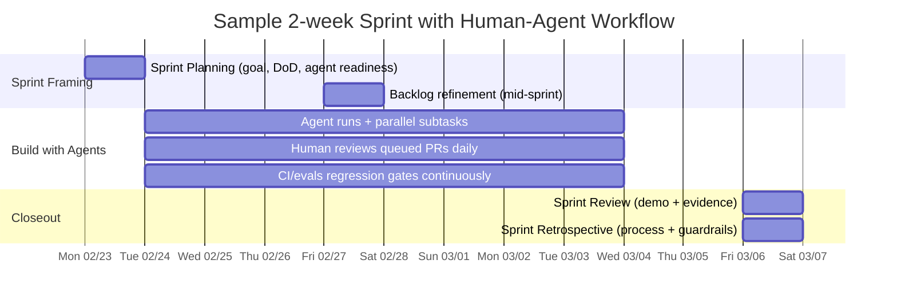
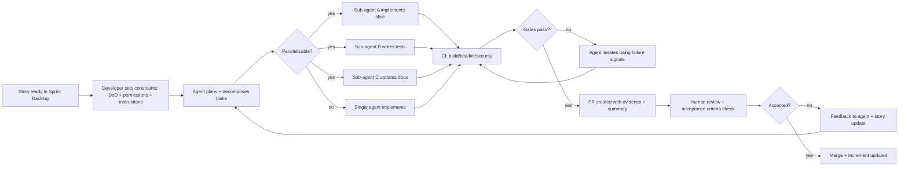

# Vibe Analytics: Agile Agentic Analytics - Scrum for AI Agent Teams

[← Back to Vibe Analytics](Vibe-Analytics)

---

## Executive Summary

**Agile Agentic Analytics** is Scrum (per the Scrum Guide) applied to analytics and product development where a material share of implementation and verification work is delegated to AI coding agents—operating asynchronously, in parallel, and through tool integrations (IDE/CLI/CI) that can read/modify repositories, run commands, and open or review pull requests.

**Core insight:** The fundamental Scrum principles—empiricism, transparency, inspection, and adaptation—become **more, not less, important** as output throughput rises. The risk shifts from "can we build it?" to "are we building the right thing safely, correctly, and maintainably?"

As of late February 2026, the agentic coding toolchain has converged on enabling primitives that map cleanly to Scrum adaptations:

1. **Sandboxed execution environments** and permission models for safer autonomy
2. **Persistent, repo-checked instructions** (AGENTS.md / CLAUDE.md) to reduce prompting drift
3. **Orchestration + tracing/observability** (agent SDKs, traces, eval harnesses) for testable agent behavior
4. **Tight CI/CD feedback loops** (tests, linters, security checks) to close the loop at machine speed

> **Critical context:** This framework applies to software and analytics delivery where agents act on code, configs, tickets, and CI/CD. It assumes Scrum as the team's system of work and focuses on mixed human-AI collaboration rather than full automation.

---

## The Strategic Fit with Vibe Analytics

Agile Agentic Analytics operationalizes the theoretical frameworks from [Vibe Analytics principles](Vibe-Analytics):

| Vibe Analytics Principle | Agile Agentic Analytics Implementation |
|---|---|
| [Principle 2: Specification Over Execution](Vibe-Analytics-Principle-2-Specification-Over-Execution) | Stories written as "outcome + constraints + evidence" with testable criteria; AGENTS.md/CLAUDE.md as persistent specifications |
| [Principle 4: Orchestration Over Parallel Work](Vibe-Analytics-Principle-4-Orchestration) | Multi-agent workflows coordinated via Scrum ceremonies; parallel subtask execution with synchronized reviews |
| [HFIS: Claims-Evidence-Failure Penalties](Vibe-Analytics-High-Fidelity-Intent-Specifications) | Definition of Done as automated gates; CI/CD verification before human review |
| [Implementation Roadmap](Vibe-Analytics-Implementation-Roadmap) | Sprint cadence optimization; staged autonomy rollout; retro-driven hardening |

**The fundamental challenge:** AI increases output velocity, but **without strong product direction and quality discipline, it accelerates waste and technical debt**. Human accountability must remain explicit.

---

## Roles and Team Topology for Mixed Human-AI Delivery

### Core Principle: Keep Scrum Accountabilities Intact

Scrum defines accountabilities of Product Owner, Scrum Master, and Developers. **AI agents are not "Scrum roles"**—they are amplifiers to the Developers' capacity.

**Agents behave like fast junior contributors with root-like blast radius:**
- Can draft code, refactor, generate tests, run commands
- Operate in isolated/sandboxed environments
- Produce verifiable evidence (logs, test outputs, diffs)
- Require structured verification before integration

### Role Responsibilities Matrix

| Role / Function | Primary Accountability | Agent-Related Responsibilities | Typical Artifacts Owned |
|---|---|---|---|
| **Product Owner** | Maximize product value; order Product Backlog | Ensure backlog items include **testable outcomes**, safety constraints, and "why"; prioritize work that reduces verification cost/uncertainty first (instrumentation, tests, data access patterns) | Product Goal; ordered Product Backlog; outcome metrics |
| **Scrum Master** | Enable effective Scrum; remove impediments | Treat agent friction as impediments: prompt drift, missing sandbox permissions, flaky tests, lack of tracing; enforce "stop the line" when agent output quality regresses | Working agreements; retro actions; process metrics |
| **Developers** | Create a usable Increment each Sprint | Operate "agent pair/mob" patterns; build/maintain eval harnesses; enforce Definition of Done gates; curate AGENTS.md / CLAUDE.md rules; manage sandbox boundaries and tool allowlists | Sprint Backlog; code; tests; CI pipelines; DoD and verification checklists |
| **AI Agent** (coding agent sessions) | Not a Scrum accountability; a tool/worker | Executes tasks with bounded autonomy (read/write, command exec, PR creation); produces "evidence artifacts" (logs, diffs, traces) for review | Trace logs; diffs; generated tests/docs |
| **Agent Steward** (hybrid, often senior dev) | Reliability of agent workflow | Owns instruction files, reusable prompts/skills, evaluation suites, and regression prevention; tunes autonomy tiers | AGENTS.md / CLAUDE.md; skill library; eval suites |
| **Security / Compliance Partner** (outside Scrum Team) | Risk posture, policy | Defines guardrails for secrets, PII, code provenance, and tool access; reviews high-risk increments | Policy-as-code rules; audit logs; exception register |

**Key insight:** This mapping preserves Scrum's insistence that the Increment meet a Definition of Done while adding explicit guardrails and traceability to validate agent behavior.

---

## Backlog, User Stories, and Prioritization for Agentic Tasks

### The Failure Mode: "Implement X" Stories

**Problem:** Work items written as vague implementation requests cause agents to generate plausible-but-wrong output, shifting time into review and rework.

**Evidence:** Developers widely distrust AI accuracy and expect to verify outputs. Even experienced developers can be slowed by verification burden when using AI tools in familiar codebases.

### Solution: "Outcome + Constraints + Evidence" Stories

Rewrite backlog items with four explicit components:

1. **User/business outcome** and why it matters (Product Owner clarity)
2. **Constraints and nonfunctional requirements** (security, privacy, performance, cost, reliability)
3. **Required evidence of correctness** (tests, logs, benchmarks, screenshots, trace outputs)
4. **Agent execution boundaries** (sandbox mode and permissions; what tools/data are allowed)

---

### Agent-Aware Story Template

```markdown
## User Story (Agentic)
As a <user/persona>,
I want <capability/outcome>,
so that <measurable value / hypothesis>.

## Context / Constraints
- Domain constraints: <compliance, privacy, data residency>
- Performance/cost targets: <SLOs, budgets>
- Security boundaries: <secrets handling, allowed tools, sandbox mode>
- Operability: <logging/metrics required>

## Evidence Required (must be machine-checkable where possible)
- Automated tests: <unit/integration/e2e>, coverage expectations
- Static checks: <lint/typecheck/security scan>
- Runtime verification: <smoke test, benchmark, canary>
- Traceability: links to CI runs, agent traces/logs, PR diff

## Agent Execution Plan (high-level)
- Candidate subtasks suitable for parallel agents
- Tools allowed (e.g., repo read/write, test runner, ticket updates)
- Disallowed actions (e.g., dependency additions without approval)
```

---

### Acceptance Criteria (Agentic-Friendly)

```markdown
## Acceptance Criteria
Given <initial state>,
When <change is applied>,
Then <observable behavior>.

And:
- All CI checks pass (list explicitly)
- No new critical security findings
- No new flaky tests introduced
- Docs updated (if user-facing or operationally relevant)
- Rollback plan exists (if deploy-affecting)
```

**Philosophy:** Ground agent work in deterministic graders and structured outputs so success can be scored consistently, treating agent behavior as testable over time rather than "vibes."

---

### Prioritization Heuristics for Agentic Work

Traditional feature value prioritization must explicitly consider **verification cost** and **feedback loop latency**.

**Practical ordering heuristics:**

1. **First, buy down uncertainty**
   Add tests, observability, CI reliability, and reproducible environments. Agents improve dramatically when they can run "tight loops" (compile/test/inspect) with clear failure signals.

2. **Prefer small, composable vertical slices**
   Agent tasks complete quickly and safely when bounded. Multi-agent patterns benefit from parallelism only when work can be decomposed cleanly. (Codex notes tasks often complete in minutes to tens of minutes.)

3. **Prioritize scaffolding artifacts**
   AGENTS.md / CLAUDE.md, rule files, skills/commands reduce per-story prompt overhead and stabilize behavior across Sprints.

**Warning:** Speed without direction and quality discipline risks becoming a "feature factory" that accumulates technical debt.

---

## Sprint Cadence, Ceremonies, and Artifact Adaptations

### Sprint Length Recommendations

Scrum allows any fixed Sprint length ≤1 month. In agentic teams, cadence choice should be driven by:
- **Model/tool volatility** (toolchains evolve quickly)
- **Risk** (deployment criticality, regulatory constraints)
- **Review bandwidth** (faster agent throughput can create review bottlenecks)

#### Sprint Cadence Comparison

| Sprint Length | When It Fits Best | Upsides | Failure Modes | Practical Recommendation |
|---|---|---|---|---|
| **1 week** | High volatility, early adoption, heavy workflow redesign | Fast inspect/adapt; smaller batch size; quick guardrail iteration | Ceremony overhead; shallow increments if stories too large | Use when onboarding agents or changing toolchains; keep stories tiny and invest in automation first |
| **2 weeks** | Most common "steady-state" for product teams | Balance between flow and learning; enough time for meaningful Increment | Review bottleneck if agents overproduce; "half-done" stories if DoD weak | **Default recommendation** for mixed teams unless domain requires longer validation |
| **3-4 weeks** | Regulated domains, complex integration testing, hard coordination | More time for stakeholder validation and operational readiness | Larger batch size increases risk; delays feedback, increases rework | Only if verification lead time cannot be compressed; counterbalance with strong CI gates |
| **Continuous flow** (Scrum-compatible within Sprint) | Mature CI/CD, small deployable slices, high automation | Near-real-time delivery; agents can run continuously | Can degrade into "no planning"; weak Sprint Goal; unbounded WIP | Keep a Sprint Goal; treat pipeline as "single source of truth" for releasability |

---

### Ceremony Adaptations

#### Sprint Planning

**Agent readiness checks must be explicit:**
- Repo instructions (AGENTS.md / CLAUDE.md) up to date
- How to run tests documented
- Sandbox permissions configured
- Evidence requirements defined for acceptance

**Codex** supports instruction discovery via AGENTS.md layering (global → project → nested overrides).
**Claude Code** supports hierarchical memory (org, project, user) including modular rule files.

These artifacts should be treated as **planning inputs, not optional documentation**.

---

#### Daily Scrum

Keep the Daily Scrum focused on Sprint Goal progress, but add two explicit inspection signals:

1. **"What did agents complete / attempt?"**
   PRs opened, tests run, failures logged

2. **"Where is human attention needed?"**
   Review queues, blocked permissions, unclear acceptance tests

**Preserves Scrum's intent**—inspect and adapt daily—while acknowledging that "work performed" includes autonomous agent actions logged in traces/CI.

---

#### Sprint Review

Demo the Increment, but also demo **evidence:**
- CI dashboards
- Eval scores
- Reproducibility (can we re-run this analysis/build?)

**Mirrors Codex's emphasis** on citations/logs/tests for verifying what the agent did.

---

#### Sprint Retrospective

Retros should explicitly include **"agent system health":**
- Regression in evals
- New failure modes (prompt injection, tool misuse)
- Verification pain points

**Matches both:**
- Scrum's focus on improving effectiveness
- Modern agent guidance emphasizing continuous improvement loops (e.g., end-of-session documentation updates)

---

### Sample Two-Week Sprint Timeline



---

## Engineering Workflow: CI/CD and Verification for Agent Outputs

### The Engineering Principle

**Treat agents as fast junior contributors with root-like blast radius.**

**Operational reality:**
- Tools can create real diffs rapidly
- Correctness and safety require structured verification
- Users must manually review and validate agent-generated code before integration
- Agents provide logs/tests as evidence

**Security model emphasizes:**
- Sandboxing and configurable permissions
- MCP server allowlists checked into source control
- Prompt injection and excessive agency as key risks

---

### Definition of Done as a Gate

**The single most important Scrum artifact adaptation** for agentic teams: it converts "fast output" into "safe, releasable Increment."

The Scrum Guide ties the Increment's commitment directly to the Definition of Done. Engineering practices emphasize continuous integration, automated testing, and the deployment pipeline as the **single source of truth for release readiness**—rejecting changes when tests fail.

---

### Agentic Definition of Done (Template)

```markdown
## Definition of Done (DoD)

### Build & Compilation
- Code compiles/builds successfully in CI

### Automated Testing
- All required automated tests pass (unit + integration; add e2e for high-risk changes)
- New/updated tests:
  - Fail before the fix (for bug fixes) OR prove the new behavior (for features)
  - Cover negative/edge cases relevant to the story

### Static Analysis
- Lint, typecheck, formatting, policy-as-code all pass

### Security Gates
- No new critical/high findings from SAST/dependency/license scanning
- No secrets introduced
- SBOM updated if required by policy

### Observability & Operability
- Logs/metrics updated for new behaviors
- Runbook updates for operational changes

### Evidence & Traceability
- CI links + relevant logs attached
- Agent trace excerpt IDs documented
- PR summary with rationale included

### Human Accountability
- A human reviewer approves the PR
- Story accepted against criteria by Product Owner or delegate
```

**Aligns with:**
- Agent evaluation best practices (deterministic checks first)
- Codex GitHub Action features (structured output schemas for machine parsing)
- Security best practices (structured outputs, isolation, tool confirmations)

---

### Agent-Human Interaction Flow



**Reflects modern agent tooling patterns:**
- Agents can run in parallel
- Integrated into CI
- Constrained by explicit permissions
- Verifiable evidence trails

---

## Governance, Safety, and Metrics

### Governance and Safety Guardrails

**Combined risk surface:**
- Classic software supply chain risks
- LLM-specific issues: prompt injection, overreliance, excessive agency

**Key risks highlighted by OWASP GenAI:**
- Prompt injection
- Overreliance on AI outputs
- Excessive agency without human oversight

**OpenAI agent safety guidance recommends:**
- Prevent untrusted text from directly driving tool behavior
- Use structured outputs, guardrails, and isolation
- Explicit MCP server trust boundaries

**Claude Code security emphasizes:**
- Sandboxing
- Permission configuration
- Explicit MCP server allowlists

---

### Minimum Viable Guardrail Set

For mixed human-AI teams:

1. **Least privilege by default**
   Sandbox modes, restricted network access, explicit escalation policies

2. **Structured outputs at boundaries**
   Schemas, deterministic graders to reduce ambiguity and injection surface

3. **Trusted tool/data connectors only**
   MCP servers allowlisted and treated as production dependencies (patch management, security review)

4. **Human accountability remains explicit**
   No "the agent approved it." Sprint Review and DoD require human acceptance.

---

### Regulatory Framework References

**NIST AI Risk Management Framework (AI RMF 1.0):**
- Sector-agnostic approach to managing AI risks across lifecycle
- Provides compliance and audit language for "responsible AI"

**ISO/IEC 42001:**
- AI management system standard for organizational governance

**Note:** These are not Scrum documents, but they provide the compliance language many organizations need to operationalize AI alongside iterative delivery.

---

### Metrics and KPIs for Mixed Human-AI Scrum

**Traditional Scrum velocity becomes less meaningful** when agents can spike output. KPIs should shift toward **flow + quality + cost + trust calibration**.

#### Balanced KPI Set

**1. Delivery Throughput/Stability (DORA Metrics)**
- Deployment frequency
- Lead time for changes
- Change failure rate
- Recovery time
- Deployment rework rate

**2. Agent Productivity Metrics**
- Agent cycle time (prompt → PR)
- Percent of PRs merged
- Review turnaround time
- "Thrash rate" (repeated command runs / loops)

**3. Quality Metrics**
- Escaped defects
- Flaky test rate
- Security findings
- Maintainability signals (duplication, rework)

**4. Hallucination / Plausibility-Failure Rate**
**Operational definition:** Agent output that passes superficial review but fails deterministic checks (tests, typecheck, lint, schema validation) or violates documented constraints.

**Evidence:** Widespread developer distrust in AI accuracy and observed verification overhead in controlled studies.

**5. Cost and Latency**
- Tokens/requests per story
- CI minutes
- Agent sandbox runtime
- Premium request consumption

---

## Tooling and Integrations

### Tooling Stack Comparison

| Category | Representative Options | What Matters for Scrum-for-Agents | Integration Notes |
|---|---|---|---|
| **Coding Agents** | Codex; Claude Code; GitHub Copilot coding agent | Ability to run tests/commands; PR creation; evidence trails; permission model; parallelism | Codex: isolated cloud sandboxes + evidence via logs/tests<br>Claude Code: terminal/IDE/CI integration + multi-agent "teammates" |
| **Orchestration / Agent SDKs** | OpenAI Agents SDK; Claude Agent SDK; LangGraph; Microsoft Agent Framework; AutoGen | Handoffs between specialized agents; human-in-the-loop checkpoints; tracing; guardrails | Agents SDKs: structured orchestration + built-in tracing/guardrails<br>LangGraph/MS Framework: durable execution + human oversight |
| **Interoperability / Connectors** | MCP servers; repo instruction standards (AGENTS.md, CLAUDE.md) | Secure access to tickets/docs/logs; consistent agent onboarding per repo; auditability | MCP: standardized way to connect agents to tools/data<br>AGENTS.md/CLAUDE.md: predictable instruction entrypoints with hierarchy |
| **Observability / Evals** | Agent traces; deterministic graders; structured output schemas; CI pipelines | Turn retros into measurable improvements; prevent regressions; make "agent performance" a backlog item | Small prompt sets, deterministic checks (JSONL traces), rubric-based grading with schemas<br>DORA metrics for system-level outcomes |

---

### Concrete Workflow Examples

**Codex + JetBrains via MCP (Skyscanner Case Study):**
- Integrated Codex CLI with JetBrains IDE tools via MCP server
- Agent can ask IDE for compile-time issues and execute predefined run configurations
- Tightens feedback loop: "generate → ask IDE for file problems → fix exact issue"
- Improves reliability and reduces iteration time

**Claude Code in Data Infrastructure:**
- Kubernetes debugging via screenshots
- Plain-text workflow automation for non-technical finance staff
- Onboarding via repo documentation files
- End-of-session documentation updates improve future performance

**GitHub Agent HQ / VS Code Multi-Agent Workflows:**
- Third-party agents (Claude, Codex) run inside GitHub and VS Code
- Start sessions directly from issues/PRs
- Manage sessions across clients
- **Scrum-friendly pattern:** Backlog items as issues → assigned to agents → humans review PRs against DoD

**AGENTS.md as a Sprint Artifact:**
- "README for agents" providing build/test commands
- Predictable location with nested file support for monorepos
- Discovered and layered by agents (global + repo + nested overrides)
- Treated as living team artifact updated in retros

---

## Risks, Failure Modes, and Mitigation Patterns

### Empirically Observed Failure Modes

**1. Verification Bottleneck and Illusion of Speed**

**Evidence:** AI tools can slow experienced developers in familiar codebases because time shifts into prompting, waiting, and verification. Developers may still *believe* they are faster.

**Implication:** Bias Scrum design toward tight feedback and strong DoD gates rather than trusting output volume.

---

**2. Trust Gap at Scale**

**Evidence:** Broad survey data shows high AI adoption alongside low trust in accuracy.

**Implication:** Verification must be a first-class system. Measure quality continuously.

---

**3. Security Risks from Tool Access**

**Recurring risk categories:**
- Prompt injection
- Overreliance
- Excessive agency

**Implication:** MCP server trust boundaries, sandboxing, and permissions must be operationalized as code and policy, not informal guidance.

---

**4. Quality Decay and Maintenance Burden**

**Evidence:** AI-assisted contributions can increase productivity for some contributors while increasing rework burden on experienced maintainers and reducing original code productivity.

**Implication:** Reflect this pattern in Sprint metrics and capacity planning.

---

### Mitigation Patterns That Fit Scrum Rituals

**1. Retro-Driven Hardening**

Every recurring agent failure becomes a backlog item:
- Add a deterministic check
- Add a rule to AGENTS.md/CLAUDE.md
- Add a sandbox boundary
- Add an eval case

**Philosophy:** "Every manual fix is a candidate for a future eval."

---

**2. Tiered Autonomy**

Use escalation levels only when DoD gates and sandbox boundaries justify it:
- **Read-only** → low risk, fast exploration
- **Workspace-write** → medium risk, requires review
- **Full auto** → high risk, requires strong gates

**Both Codex and Claude Code** emphasize sandbox/permission configuration to reduce risk and "approval fatigue."

---

**3. Human-in-the-Loop Checkpoints**

Require explicit human approvals at boundary crossings:
- Dependency additions
- New network calls
- Schema changes
- Production deployments

**Aligns with:** Agent safety guidance recommending tool confirmations and guardrails.

---

**4. Evidence-First Sprint Review**

Demo the Increment alongside:
- CI runs
- Eval scores
- Operational proof (can we run this in production?)

**Keep Sprint Review** a working session anchored in transparency and evidence.

---

## Conclusion: The Scrum-Agent Synthesis

**Agile Agentic Analytics is not "AI replaces Scrum."** It is **Scrum adapted to harness AI agents while preserving empiricism and human accountability.**

**The core synthesis:**

| Traditional Scrum Principle | Agentic Adaptation |
|---|---|
| **Empiricism** | More critical than ever—verify agent outputs with deterministic gates |
| **Transparency** | Agent traces, CI evidence, and eval scores make work visible |
| **Inspection** | Daily Scrums include agent progress; Retros include agent system health |
| **Adaptation** | Every agent failure becomes a backlog item; continuous improvement of guardrails |
| **Definition of Done** | Becomes the primary safety mechanism—automated gates before human review |
| **Sprint Goal** | Remains human-set; agents execute toward the goal under constraints |

**The paradigm shift:**

> Speed without direction and quality discipline accelerates waste. Scrum for AI agents means **moving fast AND moving right**—with testable outcomes, clear constraints, and evidence-based verification at every step.

---

## Further Reading

### Within Vibe Analytics
- [Vibe Analytics Overview](Vibe-Analytics) - Core principles and strategic vision
- [Principle 2: Specification Over Execution](Vibe-Analytics-Principle-2-Specification-Over-Execution) - Writing clear specifications
- [Principle 4: Orchestration](Vibe-Analytics-Principle-4-Orchestration) - Multi-agent coordination
- [HFIS Practical Guide](Vibe-Analytics-HFIS-Practical-Guide) - Templates for agent-ready stories
- [HFIS Technical Deep Dive](Vibe-Analytics-High-Fidelity-Intent-Specifications) - Governance frameworks
- [Implementation Roadmap](Vibe-Analytics-Implementation-Roadmap) - Phased adoption strategy
- [Risks and Mitigation](Vibe-Analytics-Risks-and-Mitigation) - Managing quality degradation and organizational resistance

### Related Content
- [Project Experiment](Project-Experiment) - Experimentation methodology for measuring agent impact
- [Anthropic Engineering Knowledge Base](Anthropic-Engineering-Knowledge-Base) - Agent architecture and best practices
- [Claude Code Architecture Guide](The-Claude-Code-Architecture-and-Ecosystem-Exhaustive-Technical-Guide) - Technical deep dive on Claude Code

---

[← Back to Vibe Analytics](Vibe-Analytics)
